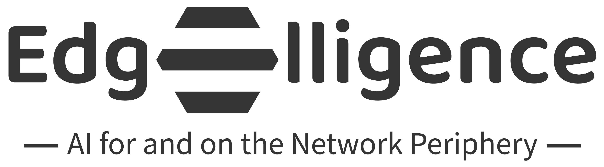

---
At the forefront of edge intelligence, our research group relentlessly pursues breakthroughs. By fostering a culture of diverse perspectives, we cultivate an environment that unlocks the power of AI at the network edge, pioneering the future of intelligent, distributed computing. We explore two frontiers:
- **AI for the Edge:** We develop AI techniques to optimize edge computing performance, enabling faster processing and smarter decision-making at the network edge.
- **AI at the Edge:** We unlock the potential of distributed and federated learning, allowing AI models to run efficiently on edge devices, unlocking new possibilities for secure and localized intelligence.

Shape the future of next-level computing, one intelligent edge at a time: join our team!

<!--

## Hi there 👋

**Here are some ideas to get you started:**

🙋‍♀️ A short introduction - what is your organization all about?
🌈 Contribution guidelines - how can the community get involved?
👩‍💻 Useful resources - where can the community find your docs? Is there anything else the community should know?
🍿 Fun facts - what does your team eat for breakfast?
🧙 Remember, you can do mighty things with the power of [Markdown](https://docs.github.com/github/writing-on-github/getting-started-with-writing-and-formatting-on-github/basic-writing-and-formatting-syntax)
-->
